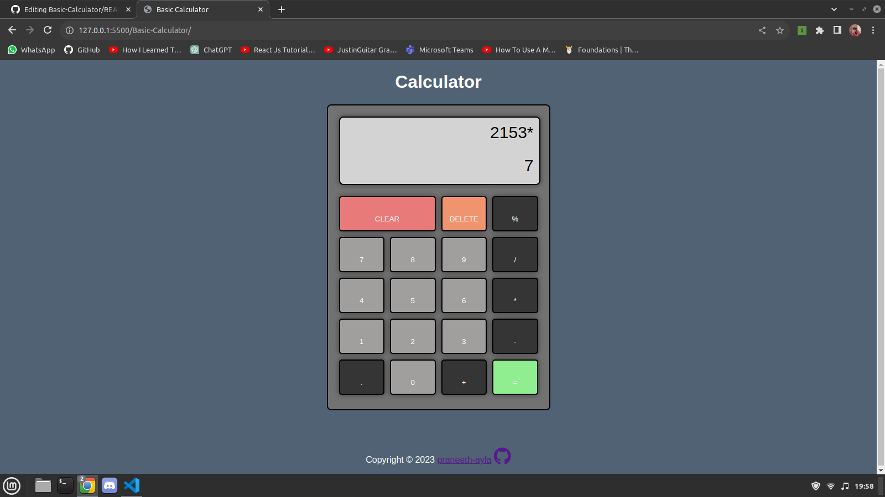

# Basic Calculator Web App
[Live Demo](https://praneeth-ayla.github.io/Basic-Calculator/) :point_left:

This is a simple web-based calculator application that allows users to perform basic arithmetic operations like addition, subtraction, multiplication, division, and calculating remainders. It's a handy tool for quick calculations, whether you're at work, school, or just need a simple calculator online.

## Features
* Addition (+)
* Subtraction (-)
* Multiplication (*)
* Division (/)
* Remainder (%)
* Clear button to reset the calculator
* Delete button to remove the last input
* Decimal point (.) for decimal numbers

## Perform Calculations

* Click the number buttons to input numbers.
* Click the operator buttons (+, -, *, /, %) to select an operation.
* Click the equals (=) button to calculate the result.
* Use the clear (CLEAR) button to reset the calculator.
* Use the delete (DELETE) button to remove the last input.

## Technologies Used
* HTML
* CSS
* JavaScript

## Compatibility
The Basic Calculator Web App should work in modern web browsers that support HTML5, CSS3, and JavaScript.

### [Inspired by The Odin Project](https://www.theodinproject.com/lessons/foundations-calculator)
